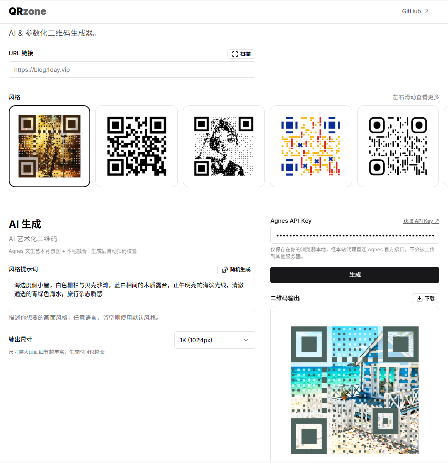

# QRzone

AI & 参数化二维码生成器。作者：[无辣](https://blog.1day.vip)。



## 特性

- **参数化样式**：十余种参数化二维码风格，纯前端渲染，支持 SVG / JPG / PNG 下载
- **AI 生成**：接入 [Agnes Image 2.5 Flash](https://www.agnes-ai.com/zh-Hans/docs/agnes-image-25-flash) 文生图模型：先让 AI 生成一张艺术背景图，再在本地按二维码矩阵把背景融合成可扫描的艺术二维码（二维码成为画面的一部分，而非叠加在图上）
- **自动扫码校验**：生成结果自动做本地扫码验证，对比不足时自动增强，仍不通过则用标准二维码兜底
- **扫码识别**：上传二维码图片自动识别内容并填入
- **无账号、无存储**：不需要登录，不保存任何数据；API Key 仅保存在用户浏览器 localStorage

## 使用

1. 打开首页，输入 URL 或文本（也可上传二维码图片识别）
2. 选择风格、调整参数
3. AI 风格需在页面中填写你自己的 Agnes API Key（[获取地址](https://platform.agnes-ai.com/settings/apiKeys)）
4. 下载 SVG / JPG / PNG

## 开发

> 需要 Node.js 18+（推荐 20+）

```bash
yarn install
yarn dev        # http://localhost:3000
yarn build      # 生产构建
```

技术栈：Next.js 14 (App Router) + React 18 + TypeScript + Tailwind CSS + next-intl

## 部署

QRzone 是纯前端 Next.js 应用（Agnes 请求由浏览器直连，无服务端代理）。两种方案均走**纯静态导出**：构建命令 `STATIC_EXPORT=true yarn build`，产物输出到 `dist/` 目录。

### 方式一：腾讯云 EdgeOne Pages（推荐，国内访问快）

1. **Fork 本仓库**：点击本仓库右上角 **Fork**，把它复制到你的 GitHub 账号下；
2. **创建项目**：打开 [EdgeOne Pages 控制台](https://console.edgeone.ai/)，点击 **创建项目 → Connect to Git** → 授权 GitHub → 选中你 fork 的 `qrzone` 仓库；
3. **构建配置**按下表填写（仓库里的 `edgeone.json` 已自动设定构建/安装/输出目录，按表填写仅为兜底）：

| 配置项 | 填写值 |
|---|---|
| 框架预设 | `Next`（若列表里只有 `Next` 就选它；没有就选「静态站点」，`edgeone.json` 会覆盖） |
| 根目录 | `/` |
| 安装命令 | `yarn install` |
| 构建命令 | `STATIC_EXPORT=true yarn build` |
| 输出目录 | `dist` |
| Node 版本 | `20`（环境变量 `NODE_VERSION` 设为 `20`） |

4. **点击部署**，等待构建完成（约 2~4 分钟），即可获得 `xxx.edgeone.app` 专属域名；
5. **绑定自定义域名**（可选）：项目设置 → 自定义域名 → 添加你的域名并按提示加 CNAME 记录。

> 全程无需配置任何密钥：Agnes API Key 由每位访客在自己浏览器中填写，不经服务端存储。

### 方式二：Cloudflare Pages

1. **创建项目**：打开 Cloudflare 控制台 → **Workers & Pages → 创建 → Pages → Connect to Git**，选中你 fork 的 `qrzone` 仓库、`main` 分支；
2. **构建配置**按下表填写：

| 配置项 | 填写值 |
|---|---|
| 框架预设 | `无`（None） |
| 构建命令 | `STATIC_EXPORT=true yarn build && cp public/_redirects dist/_redirects` |
| 构建输出目录 | `dist` |
| 环境变量 | `HUSKY=0`（可选，避免 `prepare` 钩子报错） |

3. **点击部署**，约 1~3 分钟完成，获得 `qrzone.pages.dev` 地址；
4. **绑定自定义域名**（可选）：该 Pages 项目 → **自定义域** 中设置。

> 提示：国内访问 Cloudflare 可能不稳定，介意的话选方式一（EdgeOne Pages）。

## 可选环境变量

- `NEXT_PUBLIC_SITE_URL`：站点地址，用于 SEO metadata（可选）。
- **Agnes API Key 无需服务端配置**：每位用户在前端页面填写自己的 Key，仅存于浏览器 `localStorage`，由浏览器直连 Agnes，服务端不留存、也不读取任何相关环境变量。

## License

[GPL-3.0](LICENSE)
